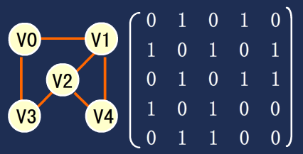
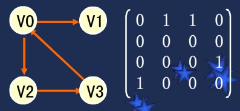
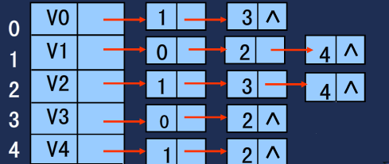

### 拓扑排序

拓扑排序（Topological Sorting）是一个有向无环图（DAG, Directed Acyclic Graph）的所有顶点的线性序列

1.每个定点出现且出现一次
2.若存在一条从顶点A到顶点B的路径,那么在序列中顶点A出现在顶点B的前面
3.下图是一个DAG图,比较常用的的方法:

1.从DAG图中选择一个没有前驱(即入度为0)的顶点输出
2.从图中删除该顶点和所有以它为起点的有向边
3.重复1和2直到当前的DAG图为空或当前图中不存在

4.【注意】一个有向无环图可以有一个或多个拓扑排序序列

### 拓扑排序的应用场景

1. 比如工程之间的依赖,如果用DAG图来表示一个工程,其中每一个顶点表示工程中的一个任务,用有向边表示任务之间的依赖,
任意两个任务之间要么具有确定的先后关系,要么没有关系,绝对不存在互相矛盾的关系(即环路).

### 需要的数据结构

1. 图的存储方式有两种: 邻接矩阵、邻接表.
2. 图分为无向图与有向图.

3. 无向图矩阵,一般是对称矩阵

4. 有向图矩阵,一般是非对称矩阵

5. 无向图的邻接表,每一个结点后面所接的结点都是它的邻接结点

6. 需要的标准用语:点(Vertex),边(Edge),权值(Weight),入度(),出度()

### 相关图的一些算法

1. [最短路径算法](https://en.wikipedia.org/wiki/Dijkstra%27s_algorithm)

2. [使用图论开发一个javascript推荐引擎](https://medium.com/@keithwhor/using-graph-theory-to-build-a-simple-recommendation-engine-in-javascript-ec43394b35a3)

### 项目代码

1. TopologicalSorting

### 那些框架中使用了拓扑排序算法

1. [Castle.Core-容器中类依赖](https://github.com/castleproject/Core)

2. [ABP-模块依赖](https://github.com/aspnetboilerplate/aspnetboilerplate)